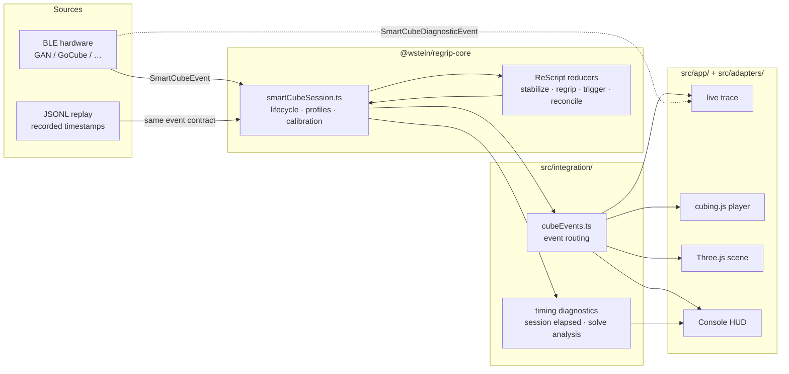

# Regrip architecture

Regrip separates deterministic smart-cube behavior from browser presentation. Live Bluetooth and
recorded JSONL enter through the same transport contract; session state lives in the reducer chain,
never in the UI.

## Design goals

The `@wstein/regrip-core` boundary provides:

- **Hardware-independent behavior.** A captured input stream reproduces domain decisions without
  requiring the physical cube.
- **Shared behavior.** Regrip and other hosts can consume the same calibration, stabilization,
  regrip, trigger, recovery, and frame-mapping rules.
- **Enforced separation.** Core cannot reach the DOM, Signals, Three.js, or Console integration.
- **Race and integrity safety.** Packet gaps, duplicate snapshots, player-solve races, and replay
  timing are explicit state machines rather than event-handler ordering conventions.

## Workspace layers

```text
packages/core/src/domain/       Pure ReScript reducers and cube math
packages/core/src/bindings/     Typed boundary to smartcube-web-bluetooth
packages/core/src/session/      Portable connection lifecycle, profiles, and replay
src/adapters/                   cubing.js and Three.js host adapters
src/integration/                Browser effects: events, timing, export, connection chooser
src/app/                        DOM, Signals, controls, trace, styles, and composition root
```

`src/app/index.ts` is the composition root. The browser Console composes the portable core with
rendering and controls; it does not own Bluetooth decoding or gyro/regrip math.

### Dependency rules

- `packages/core/src/domain/` is deterministic math: no DOM, Bluetooth, renderer, clock, or
  framework dependencies.
- `packages/core/src/session/` may use core bindings and domain modules but cannot reach the app,
  adapters, or integration layers.
- `src/integration/` applies session output to browser concerns without depending on presentation.
- `src/adapters/` contains cubing.js and Three.js objects; those objects do not leak into the app.
- `src/app/` is the only Signals and DOM layer.

`npm run lint` enforces the TypeScript import boundaries in both workspace roots. ReScript
interfaces, compilation, and paired reducer tests enforce the pure-domain boundary.

## Event pipeline



`smartCubeSession.ts` owns stabilization, regrip, custom-trigger, shake-trigger, move tracking, and
snapshot policy state. It publishes one ordered session stream. `cubeEvents.ts` applies that output
to the player, export model, trace, and renderer; it does not call the reducers itself.

Domain reducers receive timestamps as input rather than calling the host clock. Effects are data
(`AddMove`, `SetAlgorithm`, and similar values), executed by the session or integration layer.

## Deterministic replay

JSONL replay injects recorded timestamps through the same session and reducer chain as a live
connection. Given the same starting configuration and source events, the domain produces the same
state, virtual regrips, triggers, elapsed time, and solve metrics. UI animation and log rendering are
not part of that deterministic guarantee.

Two replay feeds serve different investigations:

- **Recorded events (exact)** replays saved session output, preserving recorded regrips and gesture
  detections even when a capture began after detector history was established.
- **Re-detect sensor data** sends captured transport samples through a fresh session using the
  recorded feature configuration. Results may differ when calibration or detector history predates
  the capture.

Replay mode is selected before session construction. The Console does not swap a live session at
runtime. Replay code and bundled fixtures are lazy-loaded only after replay is requested;
`npm run check:replay-lazy` enforces that production-bundle boundary.

## Coordinate frames and state invariants

| Frame  | Fixed to      | Used for                                              |
| ------ | ------------- | ----------------------------------------------------- |
| Sensor | IMU die       | Raw BLE quaternion                                    |
| Body   | Cube shell    | Protocol `MOVE` and `FACELETS` values                 |
| World  | Room/gravity  | Stabilization, regrip detection, rendered pose        |
| Solver | User notation | Exact integer Body↔Solver move and facelet projection |
| Scene  | Renderer      | Three.js home pose                                    |

`SensorToBody` is a fixed per-model axis convention. `GyroOrientation` captures the session's
body-to-world basis. `VirtualCubeFrame` separately maintains the exact solver-to-body permutation.
World quaternion math never translates notation or facelets, avoiding floating-point drift in the
solver frame.

All **Copy state** formats remain in canonical `URFDLB` body order. Virtual regrips change displayed
moves and the grip indicator but never rotate compact or color facelets, permutation cycles,
CP/CO/EP/EO, KPattern JSON, Regrip state JSON, or Orbit64. Exports therefore remain directly
comparable with protocol snapshots, solvers, and external tools.

## Gyro, regrips, and gestures

Per-device profiles define sensor axes, stabilization, battery presentation, protocol quirks, and
feature overrides. The gyro pipeline combines cube-symmetry magnetic detents, hysteresis, velocity
gating, drift adjustment, display-rate coalescing, and a configurable microjitter threshold.

`RegripDetector` emits body-frame `x`, `y`, or `z` only when an unambiguous cardinal quarter turn
strictly improves the residual and falls inside the acceptance region. Diagonal calibration dead
zones and ambiguous half turns leave the ratchet unchanged. Accepted body tokens are projected into
the solver frame for display.

Custom gestures are independent typed session events:

- `MoveBackTrigger` recognizes a face followed by its inverse within the configured window (300 ms
  by default), such as `R R'`.
- `ShakeTrigger` recognizes a configurable burst of reversal-bearing calibrated orientation steps.
  Sample gaps, a nearby face turn, and cooldown rules reject accidental candidates.

Both are configured under `features.customTrigger.triggers`, recorded in JSONL, and preserved by
exact session-output replay. The `all` feature preset enables returned-face and shake triggers;
profiles or hosts may override their thresholds.

## Events, hardware, and diagnostics

Normal transport events include `MOVE`, `FACELETS`, `GYRO`, `HARDWARE`, `BATTERY`, and `DISCONNECT`.
Optional protocol metadata is present only when supplied by hardware: GAN serial/cubie state,
GoCube center orientation, model type, and Edge offline statistics. Clock skew is calculated only
for cubes exposing cube timestamps; GoCube solve timing remains locally measured.

Some encrypted protocols require a MAC address. When automatic advertisement watching is
unavailable, the Console requests one rather than weakening the transport boundary.

### Diagnostic boundary

`SmartCubeDiagnosticEvent` is not a `SmartCubeSessionEvent`. Diagnostics provide packet-level
decoder evidence for a default-off trace channel and never enter cube-state reducers, gesture
detectors, or normal JSONL replay capture. The app keeps a separate 512-entry diagnostic buffer and
caps displayed payloads at 512 bytes, so decoder noise cannot evict session evidence.

| Protocol family   | Diagnostic evidence                                                                          |
| ----------------- | -------------------------------------------------------------------------------------------- |
| GoCube            | Plaintext UART `RAW_PACKET` frames and malformed-frame reasons                               |
| GAN               | Decrypted `DECODED_PACKET` frames and validation failures; encrypted radio bytes are omitted |
| MoYu32            | Decrypted opcode frames and unknown-opcode reports; encrypted radio bytes are omitted        |
| Giiker / MoYu MHC | Plaintext frames and malformed-frame reasons                                                 |
| QiYi              | Unknown decoded packets that could not become a cube event                                   |

The diagnostic kinds are `RAW_PACKET`, `DECODED_PACKET`, `MALFORMED_PACKET`, and `UNKNOWN_PACKET`.
A valid decoded packet continues through the normal event stream; an unrecognized packet remains
diagnostic-only.

## Reducer and module map

Core state machines follow this pattern:

```text
(state, input) -> (nextState, effects)
```

| Module or directory                                 | Responsibility                                                     |
| --------------------------------------------------- | ------------------------------------------------------------------ |
| `packages/core/src/session/smartCubeSession.ts`     | Lifecycle, ordered events, calibration, regrips, and triggers      |
| `packages/core/src/session/profile/`                | Profile inheritance, matching, overrides, and per-field provenance |
| `packages/core/src/session/replay/replaySession.ts` | Virtual-clock replay at transport or session-output level          |
| `CubeFacelets.res` / `CubeNotation.res`             | Solved-state detection, facelet conversion, and notation types     |
| `Quaternion.res` / `CubeSymmetry.res`               | Quaternion math and the 24 cube orientations                       |
| `GyroPipeline.res` and its component reducers       | Detents, hysteresis, velocity gating, drift, and calibrated poses  |
| `RegripDetector.res` / `VirtualCubeFrame.res`       | Virtual rotations and exact Body↔Solver mapping                    |
| `MoveBackTrigger.res` / `ShakeTrigger.res`          | Returned-face and calibrated-orientation gesture detection         |
| `MoveTracker.res` / `SnapshotDeduper.res`           | Serial-gap detection and duplicate/unsolicited snapshot policy     |
| `PlayerSync.res` / `ReplayCursor.res`               | Race-safe player reconciliation and deterministic replay cursor    |
| `src/integration/`                                  | Browser event routing, timing, exports, and metadata               |
| `src/adapters/cubing/` / `src/adapters/three/`      | Solver/player and renderer boundaries                              |

The ReScript compiler produces `*.res.mjs`; genType derives typed `*.gen.ts` wrappers from public
interfaces. The release check packs the core and compiles isolated TypeScript and ReScript
consumers against the resulting tarball.

## Maintainer boundaries

The `smartcube-web-bluetooth` dependency is pinned to a tested commit. Update it deliberately, run
the event-contract and full test suites, and commit its lockfile change with the dependency update.

`repomix.config.json` defines an ignored, review-safe architecture bundle for external analysis:

```sh
npx repomix --config repomix.config.json
```

The resulting `repomix-regrip.xml.txt` is a handover aid, not a build input. Hardware JSONL captures
may contain device and session data and must not be committed without review and redaction.

## References

- [Core consumer guide](packages/core/README.md)
- `packages/core/src/session/jsonlMock.e2e.test.ts` — replay contract at the connection boundary
- `packages/core/src/domain/PlayerSync.res` — reducer-plus-effects example
- `eslint.config.js` — enforced TypeScript dependency boundaries
- [David Singmaster's cycle-notation discussion (PDF)](https://maths-people.anu.edu.au/~burkej/cube/singmaster.pdf)
- [Extended Singmaster notation compiler](https://github.com/Afront/cube-notation-compiler)
- [CubeTwister Superset ENG 3×3 permutation notation](https://www.randelshofer.ch/cubetwister/doc/notations/superset_eng_3x3.html)
- [CubeTwister Pretty Patterns A410.08](https://www.randelshofer.ch/rubik/patterns/A410.08.html)
- [Superset ENG 3×3 move notation](https://www.randelshofer.ch/rubik/patterns/doc/supersetENG_3x3.html)
- [WCA Regulations, Article 12: Notation](https://www.worldcubeassociation.org/regulations/#article-12-notation)
- [CubeTwister / TWIZZLE description](https://www.randelshofer.ch/cube/twister/doc/description.php)
