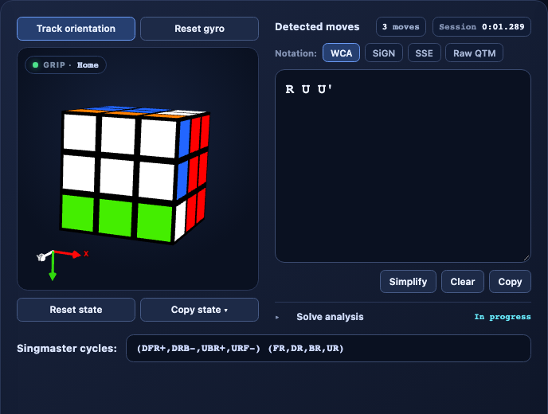
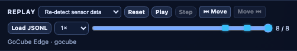

# Regrip

[](https://github.com/wstein/regrip/actions/workflows/ci.yml)
[](https://github.com/wstein/regrip/actions/workflows/pages.yml)
[](https://wstein.github.io/regrip/console/)
[](https://rescript-lang.org)
[](https://developer.mozilla.org/en-US/docs/Web/API/Web_Bluetooth_API)
[](LICENSE)

Regrip is a browser developer console and reusable session core for smart cubes. It connects to
supported hardware over Web Bluetooth, turns gyro telemetry into solver-frame regrips and gestures,
and records the same typed event stream it can replay later without a cube.

[Open the Console](https://wstein.github.io/regrip/console/) ·
[Read the docs](https://wstein.github.io/regrip/docs/) ·
[Browse the API](https://wstein.github.io/regrip/docs/api/) ·
[Understand the architecture](ARCHITECTURE.md)

> **Privacy:** All cube processing runs locally in your browser. Regrip has no application backend
> and does not upload Bluetooth telemetry, replay files, move history, analysis, or exports. Data
> leaves the browser only when you explicitly copy, download, or share it.

<a href="docs/assets/regrip-console-main.png"></a>

## Highlights

- **One headless session:** connection lifecycle, initial state, profiles, calibration, event order,
  and safe teardown live outside the UI.
- **Gyro-aware solver frame:** magnetic stabilization and calibrated orientation produce virtual
  `x`, `y`, and `z` regrips without corrupting physical cube state.
- **First-class gestures:** configurable returned-face triggers (`R R'`, for example) and
  quaternion-based shake triggers are emitted as typed, recordable, replayable events.
- **Deterministic replay:** bundled or local JSONL captures run through the same session and reducer
  chain as live Bluetooth events.
- **Developer observability:** inspect, filter, copy, and download the live event trace; decoder
  diagnostics remain isolated from cube state and replay evidence.
- **Useful cube tooling:** editable WCA, SiGN, and SSE move views; raw QTM evidence; solve analysis;
  and canonical facelet, cycle, cubie-coordinate, KPattern, Regrip JSON, and Orbit64 exports.
- **Portable core:** pure ReScript reducers and a typed TypeScript session boundary ship as the
  independently validated `@wstein/regrip-core` artifact.

Supported protocol families currently include GAN, Giiker, GoCube, MoYu, and QiYi through the
[`smartcube-web-bluetooth`](https://github.com/poliva/smartcube-web-bluetooth) v4 API. This app pins
the enhanced [`wstein` fork](https://github.com/wstein/smartcube-web-bluetooth/tree/develop) for
packet diagnostics, serial gap detection, cubie coordinates, GoCube model/offline statistics, and
vendor controls. Regrip and the standard move, facelet, battery, hardware, reset, and disconnect
paths remain compatible with stock v4.

## Quick start

Requirements: Node.js 24.15 or newer and npm.

```sh
npm ci
npm run dev
```

Open the local URL printed by Vite, then **Open Console →** (or go straight to `/console/`). The
same server proxies the VitePress guide at `/docs/`. Use **Connect** for a Bluetooth cube, or choose
a bundled capture from **Replay captures** to explore the complete Console without hardware.

Web Bluetooth works in compatible Chromium-based browsers. Some encrypted protocols need a MAC
address; when advertisement watching is unavailable, the Console prompts for it.

## Smart-cube profile schema

Bundled profiles are validated by the versioned JSON Schema at
[`https://wstein.github.io/regrip/smartcube-profile.v1.schema.json`](https://wstein.github.io/regrip/smartcube-profile.v1.schema.json).
Profile JSON files include this URL in `$schema`, enabling editor validation and autocomplete.

The version is part of the public profile-format contract. Compatible additions may remain on v1;
breaking changes require a new, separately published schema URL while retaining the old version for
existing profiles.

## Replay without hardware

The Console includes redacted GoCube Edge and GAN UI12 captures and accepts local Regrip JSONL files.
Replay provides play/pause, move-keyframe navigation, stepping, seeking, speed control, and two feed
modes:

- **Recorded events (exact)** preserves saved regrips and gesture detections.
- **Re-detect sensor data** runs captured transport samples through a fresh session using the
  recorded feature configuration.

<a href="docs/assets/regrip-replay-panel.png"></a>

The deterministic browser harness is also available at
`/test/browser/mock-app.html?replay&fixture=gocube-edge` (or `gan-ui12`). Add `&autoplay` or
`&feed=session` when testing playback behavior.

## Repository map

| Path                      | Purpose                                             |
| ------------------------- | --------------------------------------------------- |
| `packages/core/`          | Headless session, profiles, replay, and pure domain |
| `src/app/`                | Console DOM, state, controls, trace, and styles     |
| `src/integration/`        | Browser effects and session-to-UI event routing     |
| `src/adapters/`           | cubing.js and Three.js boundaries                   |
| `test/browser/`           | Playwright integration and visual tests             |
| `docs/site/`              | VitePress guide and generated API reference         |
| `ARCHITECTURE.md`         | Pipeline, frame, replay, and dependency invariants  |
| `packages/core/README.md` | Core consumer and release-artifact details          |

## Essential commands

| Command                   | Purpose                                                    |
| ------------------------- | ---------------------------------------------------------- |
| `npm run dev`             | Start ReScript watch, the Vite Console, and proxied docs   |
| `npm test`                | Build ReScript and run core plus application tests         |
| `npm run test:browser`    | Run Playwright browser tests                               |
| `npm run test:coverage`   | Enforce coverage gates and generate HTML reports           |
| `npm run build`           | Build ReScript, TypeScript, and the production application |
| `npm run lint`            | Enforce TypeScript and dependency boundaries               |
| `npm run core:pack:check` | Pack core and test isolated TypeScript/ReScript consumers  |
| `npm run docs:dev`        | Generate the API reference and serve the VitePress site    |

Use `npm run test:screenshots` for visual baselines and `npm run test:snapshot` when intentionally
updating the deterministic replay contract. See [AGENTS.md](AGENTS.md) for the complete contributor
command reference.

## Core release artifacts

`@wstein/regrip-core` is not published to npm yet. A tag matching its package version, such as
`core-v0.3.1`, runs tests, builds one tarball, validates that exact archive with isolated TypeScript
and ReScript consumers, and retains it as a downloadable GitHub Actions artifact.

Core release notes are the corresponding section of
[packages/core/CHANGELOG.md](packages/core/CHANGELOG.md). Product releases use independent
`regrip-v<version>` tags, validate the full Console build, and take their notes from
[CHANGELOG.md](CHANGELOG.md). Use the [release-notes template](.github/RELEASE_NOTES_TEMPLATE.md)
for the GitHub Release body.

## Documentation and community

- [Architecture and invariants](ARCHITECTURE.md)
- [Core package guide](packages/core/README.md)
- [Contributing guide](.github/CONTRIBUTING.md)
- [Code of Conduct](.github/CODE_OF_CONDUCT.md)
- [Security policy](.github/SECURITY.md)

Report security issues through the security policy, not a public issue. Device captures may contain
device or session data; do not commit unreviewed captures.
