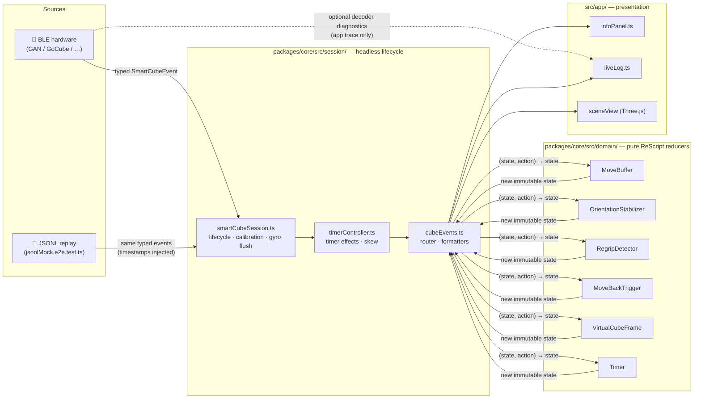

# Regrip

[](https://github.com/wstein/regrip/actions/workflows/ci.yml)
[](https://github.com/wstein/regrip/actions/workflows/pages.yml)
[](https://wstein.github.io/regrip/)
[](https://rescript-lang.org)
[](https://developer.mozilla.org/en-US/docs/Web/API/Web_Bluetooth_API)
[](LICENSE)

## Event pipeline

Two entry points, one pipeline. State lives in the session's reducer chain — never in the UI.



> **JSONL replay** feeds the exact same event types with recorded timestamps into `smartCubeSession.ts`,
> so the pure reducers produce byte-identical output to the original live session.
> See [ARCHITECTURE.md](ARCHITECTURE.md) for the full design rationale.

A single-page [Vite](https://vite.dev) example for the
[Generic Smart Cube API](https://github.com/wstein/smartcube-web-bluetooth). It uses Web Bluetooth
to auto-detect supported GAN, Giiker, GoCube, MoYu, and QiYi cubes, displays a cubing.js
`TwistyPlayer`, and provides a basic solve timer with gyro orientation.

## Highlights

- A session-owned Bluetooth lifecycle with connection status, initial-state requests, safe teardown,
  and profile resolution.
- Per-model profiles for stabilization, gyro axes, battery presentation, and protocol quirks.
- Pure ReScript magnetic gyro stabilization: cube-symmetry detents, hysteresis, velocity gating,
  and a configurable drift adjustment.
- Display-rate gyro coalescing and a profile-configurable 0.5° microjitter threshold keep high-rate
  BLE orientation packets from flooding the UI without changing the calibrated domain math.
- Virtual `x`, `y`, and `z` regrips from calibrated gyro poses. Face moves and the R/U/F orientation
  gizmo stay in the current virtual cube frame. The detector commits only an unambiguous cardinal
  quarter turn: diagonal calibration dead zones and ambiguous half turns leave its ratchet unchanged.

### Coordinate frames

The app keeps protocol and user notation deliberately separate:

| Frame  | Purpose                                                                                               |
| ------ | ----------------------------------------------------------------------------------------------------- |
| Sensor | Raw BLE quaternion from the IMU die.                                                                  |
| Body   | Cube shell: protocol `MOVE`/`FACELETS` values and URFDLB labels.                                      |
| World  | Calibrated gyro pose used only for regrip detection and rendering.                                    |
| Solver | User-facing white-up/green-front notation, maintained as an exact integer solver-to-body permutation. |
| Scene  | Renderer home pose applied after the world-relative gyro pose.                                        |

`SensorToBody` is a fixed per-model axis convention; `GyroOrientation` then captures a per-session
body-to-world basis. World quaternions never translate moves or facelets: those use `VirtualCubeFrame`'s
integer Body↔Solver mapping, updated only by detected `x/y/z` regrips.

- A 300 ms returned-face custom trigger (`R R'`, for example), detected independently of the gyro
  magnet layer.
- Editable detected moves, cube state, solve timer, JSONL recording, and a local live event trace.
  The trace supports filters, sort direction, fixed JSON detail, selection, copy/export, and replay
  of selected moves. Its default-off **Diagnostic** filter shows opt-in decoder evidence without
  entering the cube-state session, reducers, or replay capture.
- A capability-gated command panel: state/battery/hardware refresh plus supported vendor controls.
  GoCube controls include backlight actions, gyro calibration, orientation enablement, and confirmed
  reboot; every command result is recorded in the local trace and JSONL capture.

The dependency is pinned to a tested `smartcube-web-bluetooth` commit. Update it deliberately, run
the checks below, and commit the resulting lockfile change together with the package change.

## Cube information and hardware notes

- Connection state, selected protocol, capabilities, device and hardware details, and battery level.
- Standard `MOVE`, `FACELETS`, `GYRO`, `HARDWARE`, `BATTERY`, and `DISCONNECT` events.
- Optional protocol metadata only when it is supplied: GAN serial/cubie state, GoCube center
  orientation, model type, and Edge offline statistics.
- Clock skew for cubes that expose a cube timestamp. GoCube does not, so its solve time remains the
  locally measured elapsed time and its skew field reports that a cube clock is unavailable.

Some encrypted cube protocols require a MAC address. If automatic advertisement watching is not
available, the app prompts for one and explains how to enable
`chrome://flags/#enable-experimental-web-platform-features` in Chrome.

### Protocol diagnostics

The lab enables the transport library's optional diagnostic stream for a connection. It is a
debugging channel, separate from normal cube events: diagnostics are held in their own bounded
live-trace buffer (512 packets, with each displayed payload capped at 512 bytes), are off by
default, and cannot mutate cube state or evict JSONL replay evidence.

| Protocol family   | Diagnostic evidence                                                                          |
| ----------------- | -------------------------------------------------------------------------------------------- |
| GoCube            | Plaintext UART `RAW_PACKET` frames and malformed-frame reasons                               |
| GAN               | Decrypted `DECODED_PACKET` frames and validation failures; encrypted radio bytes are omitted |
| MoYu32            | Decrypted opcode frames and unknown-opcode reports; encrypted radio bytes are omitted        |
| Giiker / MoYu MHC | Plaintext frames and malformed-frame reasons                                                 |
| QiYi              | Unknown decoded packets that could not become a cube event                                   |

The packet types (`RAW_PACKET`, `DECODED_PACKET`, `MALFORMED_PACKET`, and `UNKNOWN_PACKET`) are
decoder evidence, not `MOVE` or `FACELETS` events. A valid packet continues normally through the
typed session event stream; an unrecognized one remains diagnostic-only.

## Architecture

`src/app/index.ts` is the composition root: it mounts the player and DOM controls. The reusable
headless session and pure domain live in `packages/core`; the browser-lab glue is `src/integration`.
ESLint checks both workspace roots so core code cannot depend on presentation layers.

| Module                                              | Responsibility                                                            |
| --------------------------------------------------- | ------------------------------------------------------------------------- |
| `src/app/`                                          | DOM, trace/JSONL tooling, styles, and composition root                    |
| `src/app/sessionSignals.ts`                         | App-only reactive mirror of headless session state and ordered events     |
| `packages/core/src/session/smartCubeSession.ts`     | Headless lifecycle, calibrated event stream, regrips, and custom triggers |
| `packages/core/src/session/profile/`                | Profile inheritance, matching, overrides, and per-field provenance        |
| `packages/core/src/session/replay/replaySession.ts` | Deterministic virtual-clock JSONL replay at connection or session output  |
| `src/integration/`                                  | Browser-lab connection, event routing, timer, export, and metadata glue   |
| `src/adapters/cubing/`                              | cubing.js scramble solver, facelet bridge, and TwistyPlayer               |
| `src/adapters/three/`                               | Three.js scene, orientation render loop, and R/U/F gizmo                  |
| `packages/core/src/domain/`                         | Pure ReScript cube, timing, trigger, quaternion, and stabilization logic  |

The core domain logic is [ReScript](https://rescript-lang.org), compiled in-source to `*.res.mjs`:

| Module                                                                                     | Responsibility                                                                    |
| ------------------------------------------------------------------------------------------ | --------------------------------------------------------------------------------- |
| `CubeFacelets.res`                                                                         | Pure solved-state detection and cubing.js-compatible facelet conversion           |
| `Timer.res` / `Time.res` / `MoveBuffer.res`                                                | Solve-timer state machine, formatting, and recent-move buffers                    |
| `Quaternion.res` / `CubeSymmetry.res`                                                      | Quaternion math and the 24 cube orientations                                      |
| `MagneticDetent.res` / `OrientationStabilizer.res` / `GyroOrientation.res`                 | Detents, hysteresis, velocity gating, drift, and calibrated poses                 |
| `SensorToBody.res` / `RegripDetector.res` / `VirtualCubeFrame.res` / `MoveBackTrigger.res` | Sensor axes, virtual rotations, Body↔Solver remapping, and returned-face triggers |
| `packages/core/src/bindings/Bindings_SmartCube.res`                                        | Typed timestamp-helper boundary to the Bluetooth library                          |

Hand-written `*.res.d.mts` files define the TypeScript boundary for those compiled ReScript modules.

## Development

```sh
npm install
npm run dev      # ReScript watch + Vite dev server
npm test         # Compile ReScript and run Vitest specs
npm run test:snapshot # Refresh the deterministic JSONL session-contract snapshot
npm run test:browser  # Run Chromium coverage for the WebGL orientation gizmo
npm run test:screenshots # Verify disconnected, GoCube Edge, and GAN UI12 UI baselines
npm run test:screenshots:update # Intentionally refresh those PNG baselines
npm run build    # ReScript + TypeScript + production Vite build
npm run lint     # Enforce layer import boundaries
npm run core:pack:check # Pack only @wstein/regrip-core and verify an isolated consumer
npm run docs:api # Generate TypeDoc to docs/api/
```

### Curated architecture bundle

`repomix.config.json` defines the small, review-safe architecture bundle used for NotebookLM and
visual/product analysis. It includes the app, browser integrations, and reusable core sources while
excluding device captures, generated output, and lockfiles.

```sh
npx repomix --config repomix.config.json
```

This creates the ignored `repomix-regrip.xml.txt` handover file. It is an analysis aid, not a build
input or a replacement for the generated API reference.

The JSONL replay fixture is deliberately synthetic and redacted. Do not commit unreviewed hardware
captures: exported logs can contain device and session data.

To inspect a fixture interactively in the real lab, run `npm run dev`, then open
`/test/browser/mock-app.html?replay&fixture=gocube-edge` (or `gan-ui12`). The dev-only Replay
strip supports connection-feed replay through the complete session, session-output replay for UI
inspection (`&feed=session`), play/pause, stepping, seeking, and speed selection. Use **Load JSONL**
to paste or drop an arbitrary local capture; it validates the replay header before retaining the text
only in browser session storage. New JSONL exports include the captured device and protocol identity
so replay selects the same profile as the device.

Vite DevTools is development-only and starts in passive mode. Use `⇧⌥D` on macOS to reveal it.

## API documentation

Run `npm run docs:api`, then visit
[`http://localhost:5173/docs/api/index.html`](http://localhost:5173/docs/api/index.html) while the
dev server is running. Before generation, that route provides a fallback page with the local commands.

GitHub Pages generates and serves the same reference at
[`/regrip/docs/api/index.html`](https://wstein.github.io/regrip/docs/api/index.html).
For source-native ReScript documentation JSON, use:

```sh
npx rescript-tools doc packages/core/src/domain/Quaternion.resi
```

## Community

- Read [CONTRIBUTING.md](.github/CONTRIBUTING.md) before proposing a change.
- Follow the [Code of Conduct](.github/CODE_OF_CONDUCT.md).
- Report security issues according to [SECURITY.md](.github/SECURITY.md), not in a public issue.
